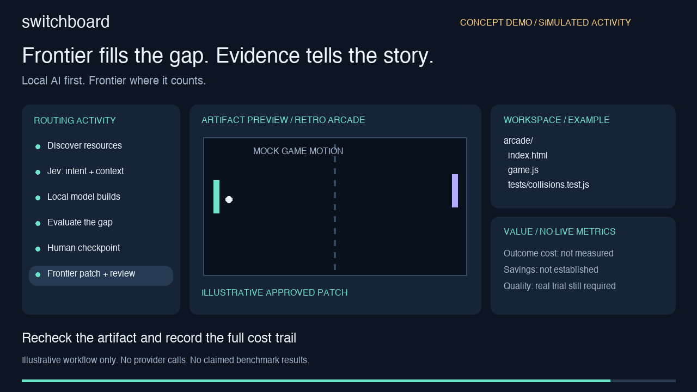
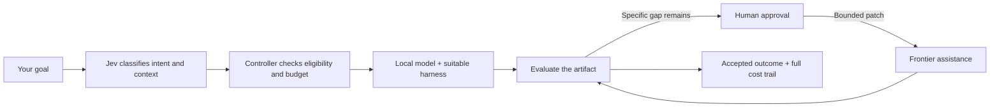

# Switchboard

### Local AI first. Frontier where it counts.

I started Switchboard to get more useful work from the local models, machines and AI subscriptions I already have. Instead of sending every task to a premium model, the aim is to let local AI build the first result—and use Frontier intelligence to close the specific gaps.

**The goal: lower cost per accepted outcome, without quietly lowering quality.**

[Roadmap & updates](#roadmap) · [30-second concept video](media/switchboard-concept.mp4) · [Video transcript](#demo-transcript)

## See the concept

**Concept animation, not recorded product execution.** The interface and activity are simulated. No measured savings are claimed. Download the MP4 if your GitHub viewer does not play it inline.

## Build locally. Find the gap. Spend deliberately.

Jev supplies structured judgments; the controller owns permissions, limits and stopping rules. No progress means pause and ask—not another expensive loop. A missing local endpoint is not permission to spend Frontier credits.

Switchboard is platform-agnostic. Model servers, harnesses and resource nodes are replaceable adapters. We aim to reuse proven tooling rather than rebuild it.

## See what your AI is actually doing

The planned dashboard makes the work inspectable:

- **Activity:** which model, harness and resource is working, waiting or stopped.
- **Files and folders:** scoped workspace changes and produced artifacts.
- **Routing decisions:** why local was selected, what gap remains, and why Frontier was proposed.
- **Statistics:** attempts, quality checks, elapsed time, token usage and full outcome cost.
- **Value comparison:** local-plus-Frontier versus a clearly labelled comparable baseline.

Subscription allocations, API-equivalent estimates and actual spend are different numbers. Missing usage remains unknown. Savings are reported only when evidence supports both cost and quality.

## Progress — 22 September 2026

Product scope and architecture are documented. An offline Jev evaluation adapter has been tested, and one bounded synthetic live probe validated Choice, Score and Noul. Harness research has strengthened execution, approval and accounting contracts.

**Next:** immutable Goal intake and offline controller safety fixtures. The full routing workflow, live local execution and outcome savings remain unproven.

The first planned trial is a small retro arcade game, followed by image and ComfyUI workflow analysis.

## Roadmap

| Milestone | Status | What it must prove |
| --- | --- | --- |
| Product and safety architecture | Documented | Clear ownership, human gates and outcome criteria |
| Jev adapter | Prototype tested | Broader task qualification still needed |
| Offline controller | Next | Goal intake, reservations, recovery and bounded actions |
| Local arcade-game trial | Gated | A working artifact with acceptance evidence |
| Targeted Frontier patching | Gated | Specific gaps resolved with approved spend |
| Activity and value dashboard | Planned | Honest activity, files, model identity and cost statistics |
| Image and ComfyUI workflows | Later | Reproducible quality and resource accounting |
| Sanitized public implementation | Not released | Comprehensive testing and release approval |

This README is the public update log. Development is private until an explicitly approved, sanitized public release. GitLab is the intended home for collaborator development; this GitHub repository is the public roadmap and concept preview, not an installable release.

## Demo transcript

The silent concept video shows six five-second scenes: discover local capacity; classify intent with Jev; build locally; identify a collision-behaviour gap; ask for human approval; then illustrate a targeted Frontier patch and outcome review. Activity, workspace files and statistics sit alongside the candidate artifact throughout. The UI and game motion are simulated; cost savings are not yet measured.

## Public preview

The public preview contains **this README and reviewed concept media only**. Implementation, detailed planning, configuration, dotfiles, credentials and operational records stay private. A sanitized public implementation follows comprehensive verification, privacy/security checks and a separate release decision.

No installation or API keys are needed to explore this preview.

## Follow the build

Follow [James — @jamestervit](https://x.com/jamestervit) and [Chronara AI — @chronara_ai](https://x.com/chronara_ai) for progress, concept previews and lessons from the build.

Kevin_8663 is our AI assistant. Milestone-to-update automation is a future workstream, not a live feature: verified progress first, human-approved public communication second.
