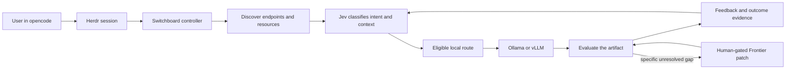

# Switchboard

## Local AI, routed with evidence

Switchboard is a local-first AI management and routing project. It is designed to help me use the models, machines, agent harnesses, and subscriptions I already have more intelligently—so Frontier capacity is used when it adds real value, not simply because it is the easiest option.

The goal is not to avoid Frontier models completely. The goal is to make every escalation explainable:

> What did this attempt cost, did it move the task forward, and is the next action worth taking?

Switchboard is currently a pre-release design and qualification project. The architecture, product direction, and safety boundaries are being established before live model execution is enabled.

## Why I started this

Local AI is becoming practical, but managing it is still fragmented. Models live in different stores, endpoints appear and disappear, machines have different memory and performance, and each agent harness has its own strengths and limitations.

At the same time, subscription and API usage can grow without producing better outcomes. A workflow may spend money on retries, oversized context, repeated reasoning, human review, or an escalation that did not resolve the actual gap.

I started Switchboard to create a control plane for that complexity:

- discover what local resources are available now;
- classify what a task actually needs;
- select a model, harness, context set, and machine that fit;
- use local capacity first when it is eligible;
- reserve Frontier subscriptions for specific unresolved gaps;
- ask for human input when progress has plateaued or a consequential action is proposed;
- measure cost per accepted outcome rather than token cost alone;
- learn from feedback so routing improves over time.

## The concept

The primary working experience is opencode through Herdr. Switchboard is the informative control plane around that experience, not another chat interface.

Jev provides the structured decision layer. It classifies intent, complexity, risk, context relevance, quality, gaps, progress, feedback, and route value. The controller then enforces the boundaries that a probabilistic decision must not bypass: eligibility, reservations, budgets, egress, acceptance, and human gates.

The intended loop is bounded. If the system is making progress, it can continue within policy. If it plateaus, hits a budget, encounters an exception, or needs a human answer, it stops rather than burning credits for zero productivity gain.

## What makes it different

### Local-first, not local-only

Ollama or vLLM is the default execution target when a local model is healthy, capable, and eligible for the task. Claude, Codex, Grok, or other Frontier routes remain available for genuine gaps, but a missing endpoint is not treated as proof that a paid model is needed.

### Jev automates the judgment work

Jev is used for narrow, structured questions rather than free-form control prose:

- What is the request's intent and domain?
- How difficult, risky, or reversible is it?
- Which context is relevant enough to include?
- Which available route is most appropriate?
- Did the output satisfy the acceptance condition?
- What is missing, and did the attempt make progress?
- Is the next action likely to be worth its cost?

This is intended to reduce unnecessary context, manual comparison, repeated retries, and poorly justified escalation.

### Cost per outcome, not cost per token

Switchboard treats token cost as telemetry, not the final measure of efficiency. The useful unit is the full cost of one accepted result, including retries, review, exceptions, rework, latency, and paid escalation.

This makes it possible to compare:

- a cheap local attempt that needs repeated rework;
- a stronger local route that succeeds in one pass;
- a Frontier patch that resolves a specific gap;
- a Frontier-only workflow that may be simpler but more expensive.

### Human feedback without manual administration

The system should ask the user only when their judgment is consequential. Jev classifies routine feedback automatically and updates the learning state. The user remains the final authority for installation, external spend, high-risk actions, uncertain recovery, and continuing after no measurable progress.

## Current progress

### Completed

- Product vision and PRD documented.
- Cost-per-outcome definitions documented, including retries, review, exceptions, rework, and control friction.
- Architecture spine finalized and linted.
- Jev/controller ownership boundary defined.
- Default UX agreed: opencode through Herdr.
- Local endpoint discovery direction defined for Ollama and vLLM.
- Explicit local installation gate defined for missing runtimes.
- Human gates and no-progress stop conditions defined.
- Public landing page, vision document, and GitHub project draft created.

### In progress

- Epics and stories for onboarding, safe execution, and Jev feedback classification.
- Offline fixtures for eligibility, reservations, attempt logging, budgets, feedback classification, bounded next actions, and recovery.
- Public contribution and release evidence planning.

### Not started yet—and intentionally gated

- Live local model execution.
- Frontier provider calls.
- Automatic endpoint installation.
- Fine-tuning or training jobs.
- Long media renders or full ComfyUI automation.
- Hosted multi-tenant operation.

The first implementation milestone is deliberately offline: prove the routing and safety contracts with fixtures before connecting live models or spending subscription capacity.

## First proof task

The first real demonstration will be a small browser arcade game. It is simple enough to evaluate but rich enough to demonstrate:

1. local route discovery;
2. model and context selection;
3. agent-harness coordination;
4. artifact evaluation;
5. user feedback when needed;
6. bounded improvement;
7. a visible decision trace; and
8. cost-per-accepted-outcome compared with a Frontier-only approach.

After that, the project can move toward image and video workflow analysis with ComfyUI, where context selection, workflow consistency, research gaps, and long-running resource costs become more demanding tests.

## Safety principles

| Situation | Switchboard response |
| --- | --- |
| Local endpoint missing | Offer an explicit installation action; never install silently |
| Local route unavailable | Mark it ineligible; do not silently spend Frontier credits |
| Frontier escalation needed | Show the unresolved gap, expected progress, and budget impact |
| Attempts plateau | Stop and ask a concise human question before continuing |
| Agent pane is blocked | Track control friction separately from production cost |
| High-risk action | Require a human gate regardless of model confidence |
| Acceptance is unclear | Return the best candidate and state what remains unresolved |

## Repository guide

- [Vision and concept](docs/vision.md)
- [GitHub project draft](docs/github-project-draft.md)
- [Pre-release landing page](docs/index.html)
- [Build brief and blueprint review](docs/build-brief.md)
- [Review evidence](docs/review-evidence.md)
- [GitHub, Pinokio, and Jev integration plan](docs/integration-plan.md)
- [Architecture boundary](docs/vision.md#the-architecture-boundary)
- [Development workflow](docs/development-workflow.md)

The original [Switchboard Blueprint](docs/switchboard.html) is preserved as the design baseline. Its example hardware, model names, prices, and CLI commands remain assumptions until checked against the actual fleet and current provider documentation.

## Public project direction

The intended path is:

1. qualify the contracts with deterministic fixtures;
2. connect local endpoint discovery and the default opencode/Herdr path;
3. prove the arcade-game workflow;
4. measure accepted outcomes and justified escalation;
5. invite public review and pull requests once the foundation is stable;
6. consider hosted multi-tenant operation only as a later design, with credential isolation and service governance.

This project is being built in public gradually. The current priority is honest evidence: showing what has been designed, what has been tested, what has not started, and why the next step is worth taking.

**Status:** pre-release · architecture and qualification stage  
**Primary UX:** opencode through Herdr  
**Decision layer:** Jev  
**Default local target:** Ollama or vLLM  
**Next evidence:** offline routing and safety fixtures pass
