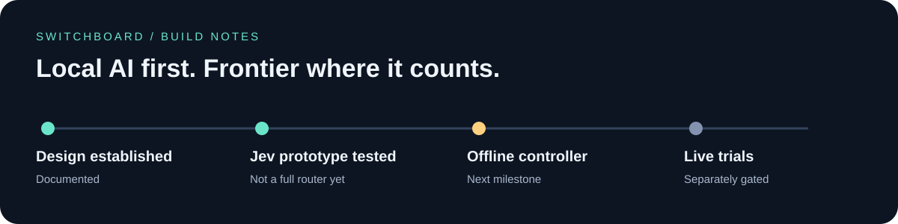
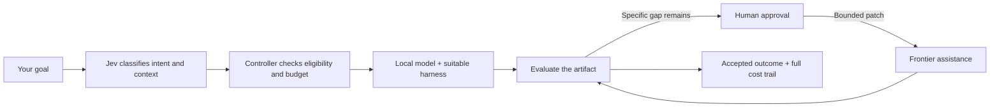
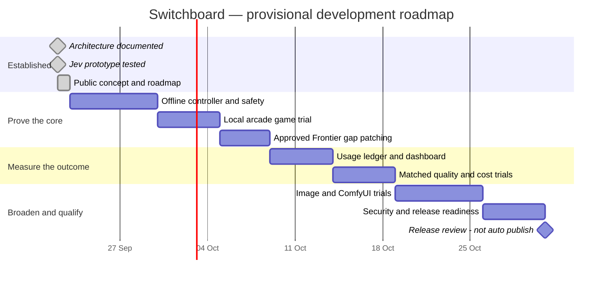

# Switchboard

### Local AI first. Frontier where it counts.

I started Switchboard to get more useful work from the local models, machines and AI subscriptions I already have. Instead of sending every task to a premium model, the aim is to let local AI build the first result—and use Frontier intelligence to close the specific gaps.

<video src="https://github.com/user-attachments/assets/e6410b00-1a0e-409a-99b4-bb339ff6e3a0" controls></video>

## Build locally. Find the gap. Spend deliberately.

Jev supplies structured judgments; the controller owns permissions, limits and stopping rules. No progress means pause and ask—not another expensive loop. A missing local endpoint is not permission to spend Frontier credits.

Switchboard is platform-agnostic. Model servers, harnesses and resource nodes are replaceable adapters. We aim to reuse proven tooling rather than rebuild it.

## See what your AI is actually doing

### Same outcome. Fewer Frontier tokens.

The sample compares **100,000 Frontier tokens without Switchboard** with a **20,000-token target using local development and targeted Frontier refinement**: an illustrative reduction of **80,000 Frontier tokens (80%)**. Both paths must satisfy the same acceptance criteria. These are scenario assumptions, not measured results, verified model prices or a forecast.

Local AI should deliver substantive working software—not just scaffolding. The separate **80% local-development target** describes a proposed work split; it does not establish an 80% token reduction.

The comparison counts Frontier input and output across attempts, including reasoning where reported without double-counting it. The sample ledger shows how the figures are derived; every usage count and rate below is an assumption, not a provider quote or a measured result.

| Worked example | Frontier-only | Switchboard |
| --- | ---: | ---: |
| Frontier input / output tokens | 80,000 / 20,000 | 16,000 / 4,000 |
| Frontier cost at assumed $1/M input + $5/M output | $0.180 | $0.036 |
| Local tokens: 60,000 input + 20,000 output; energy: 0.05 kWh at $0.20/kWh | $0.000 | $0.010 |
| Jev: 10,000 tokens at assumed blended $0.20/M | $0.000 | $0.002 |
| Human review: 2 minutes at $30/hour | $1.000 | $1.000 |
| **Accounted cost per accepted outcome** | **$1.180** | **$1.048** |

This example yields **80% fewer Frontier tokens**, but **11.2% lower accounted outcome cost** ($0.132), because review and local work still count. Total token counts rise from 100,000 to 110,000 across different tokenizers; that sum is not a normalized compute measure. The scenario assumes API billing, no allocated subscription charge, no cache hits and reasoning included within output. Capital costs are excluded. It is not a complete total-cost-of-ownership estimate. Real measurements will replace these inputs.

**What testing must establish:** equivalent accepted quality, complete usage receipts, retry and review overhead, and reproducible results against a matched baseline. The screenshot's acceptance and activity are simulated too.

The planned dashboard makes the work inspectable:

- **Activity:** which model, harness and resource is working, waiting or stopped.
- **Files and folders:** scoped workspace changes and produced artifacts.
- **Routing decisions:** why local was selected, what gap remains, and why Frontier was proposed.
- **Statistics:** attempts, quality checks, elapsed time, token usage and full outcome cost.
- **Value comparison:** local-plus-Frontier versus a clearly labelled comparable baseline.

Subscription allocations, API-equivalent estimates and actual spend are different numbers. Missing usage remains unknown. Savings are reported only when evidence supports both cost and quality.

## Progress — 23 September 2026

Product scope and architecture are documented. An offline Jev evaluation adapter has been tested, and one bounded synthetic live probe validated Choice, Score and Noul. Harness research has strengthened execution, approval and accounting contracts.

**Next:** immutable Goal intake and offline controller safety fixtures. The full routing workflow, live local execution and outcome savings remain unproven.

The first planned trial is a small retro arcade game, followed by image and ComfyUI workflow analysis.

## Roadmap

**Planning baseline: 22 September 2026. Last evidence update: 23 September 2026 (Asia/Manila).**

Dates below are provisional planning windows, not delivery commitments. Completed milestones reflect evidence already obtained; future bars do not imply work has started. Failed checks move the schedule rather than lower the acceptance bar.

Release gates: bounded controller behavior; an accepted local artifact; approved patching that closes a specific gap; complete usage accounting; matched-quality comparisons; security review and explicit public-release approval. Additional Jev and harness qualification remains required.

### Daily progress log

Update cadence: daily evidence review in Asia/Manila time. Record what changed, what passed, blockers and the next useful step. If no new evidence exists, say so; never advance completion automatically. Automated posting is not configured yet.

| Date | Evidence-backed update | Next / blocker |
| --- | --- | --- |
| 22 Sep 2026 | Architecture documented; Jev prototype tested. Public concept, sample token ledger and dated roadmap prepared. No end-to-end savings established. | Offline controller fixtures next. Private GitLab destination and daily publishing automation pending. |
| 23 Sep 2026 | Product architecture and prototype evidence remain available; an end-to-end accepted-outcome comparison has not yet been measured. | Offline controller and safety fixtures remain next. |

This README is the public update log. Development is private until an explicitly approved, sanitized public release. GitLab is the intended home for collaborator development; this GitHub repository is the public roadmap and concept preview, not an installable release.

## Public preview

The public preview contains **this README and reviewed concept media only**. Implementation, detailed planning, configuration, dotfiles, credentials and operational records stay private. A sanitized public implementation follows comprehensive verification, privacy/security checks and a separate release decision.

No installation or API keys are needed to explore this preview.

## Follow the build

Follow [James — @jamestervit](https://x.com/jamestervit) and [Chronara AI — @chronara_ai](https://x.com/chronara_ai) for progress, concept previews and lessons from the build.

Kevin_8663 is our AI assistant. Milestone-to-update automation is a future workstream, not a live feature: verified progress first, human-approved public communication second.
