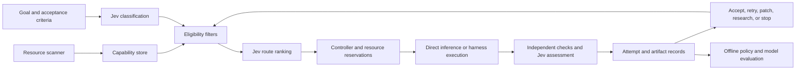

# Switchboard build brief

Prepared 20 September 2026 from the [user-provided v0.1 blueprint](switchboard.html), also available as a [web artifact](https://claude.ai/artifact/JsUqfymBt1s1LNQhwK3h7T).

This is an implementation proposal. It preserves the blueprint's local-first direction while making resource allocation, acceptance, and improvement testable. Fleet inventory, budgets, and integration behavior remain to be confirmed.

The local HTML is the complete source reference, including all open questions and source links. The user also supplied [Switchboard Blueprint.pdf](<Switchboard Blueprint.pdf>); its 20-page export is incomplete at the end of section 09 and clips wide tables. See the [HTML completeness check](review-evidence.md#html-completeness-check) for the verified content inventory. This brief is a proposed implementation companion, not a replacement for the source's full detail.

Subsequent user direction selects GitHub for development/CI/CD/PRs and Pinokio for distribution, use, and tool discovery. The [integration plan](integration-plan.md) records verified Pinokio interfaces and the existing Jev broker's access and capability limits. These extend the original blueprint without rewriting its source.

## Product contract

For each goal, select an eligible model, harness, skill set, and machine; execute within resource and budget limits; evaluate the resulting artifact; and retain enough evidence to explain the next decision. Prefer productive local work. Use frontier capacity for a specific unresolved gap when local options are exhausted or an explicit policy exception applies.

The objective is progress toward the user's acceptance conditions. A higher model score, more attempts, or more activity alone is not success. Preserve the best verified candidate when a later attempt regresses.

There are three improvement cycles:

| Cycle | Inputs | Output | Release condition |
| --- | --- | --- | --- |
| Per-goal refinement | Candidate, failures, remaining budget, attempt history | A better candidate or a terminal result | Acceptance conditions pass, or a bounded stop |
| Routing improvement | Verified outcomes and measured costs grouped by scenario and route | A versioned candidate routing policy | Replay evaluation, then a limited trial within configured limits |
| Model improvement | Reviewed examples with comparable inputs and verified outputs | A versioned local checkpoint | Independent evaluation, regression limits, and a promotion record |

Updating routing statistics does not itself train Jev. Treat Jev integration, router policy updates, and local-model tuning as distinct operations.

## Component responsibilities

Jev answers bounded questions. Application code enforces eligibility, budgets, acceptance, reservations, retries, and transitions. Jev receives only currently eligible route IDs and cannot create a new executable route by returning text.

The scanner measures availability. The model server loads and serves weights. A harness supplies a tool-use workflow. Herdr manages harness terminal sessions. These are separate capabilities: local direct inference and local inference through opencode can both exist. A hardware rung must not imply the absence or presence of a harness.

BMAD/ECC remain planning and in-session workflow inputs. LWC retains curated project knowledge. Switchboard's operational database stores executions, artifacts, and measurements; it should link relevant knowledge instead of duplicating the wiki.

## Corrections required before implementation

| Blueprint issue | Proposed correction |
| --- | --- |
| Score is assumed to be 0–1 | Preserve raw score and rubric levels; normalize by `len(criteria) - 1` when a 0–1 scale is required. Compare deltas only under the same rubric and evaluator version. |
| Noul is described as binary with confidence | Consume its `noul` value; threshold it in application code. Do not expect a separate confidence field. |
| Acceptance checks Noul and Score confidence, but not Score value | Require the actual quality threshold and all hard checks. Confidence alone can be high for a bad result. |
| One passage requires a plateau before acceptance | Accept as soon as the fixed criteria pass. Plateau detection controls unsuccessful retries, not successful completion. |
| Routing and output evaluation appear batchable together | Route before execution. Evaluate after the candidate exists. Batch only independent questions about the same available state. |
| Local exhaustion includes every untried variant | Freeze a finite eligible shortlist per decision epoch; cap retries and rescans. Newly appearing variants cannot extend a goal indefinitely. |
| All local rungs must run, but some scenarios start at frontier | Make exceptions explicit: unavailable/incompatible routes, deadlines, and scenario policy. Record the reason for every skipped rung. |
| Near-zero local cost dominates `score_delta / epsilon` | Track elapsed time, energy when measurable, memory occupancy, queue delay, and load cost separately. Retain the ratio as a diagnostic rather than the sole objective. |
| Pane counts and heartbeat readings are treated as concurrency guards | Use atomic resource and provider reservations. Pane state and heartbeats are observations, not locks. |
| A frontier/local join by goal is enough for training | Store exact inputs, outputs, parentage, evidence, and dataset eligibility. Pair only comparable attempts, avoiding a many-to-many join across unrelated revisions. |
| A new checkpoint wins by Jev's mean score alone | Require task-specific success measures, independent checks, and per-scenario regression limits. Track latency and resource changes as well. |

The Score range and response fields above were checked against TypeSafe's [Score](https://docs.typesafe.ai/primitives/score) and [Noul](https://docs.typesafe.ai/primitives/noul) documentation. TypeSafe describes confidence as a statistic of the returned distribution; it is not an external correctness guarantee. See [Confidence](https://docs.typesafe.ai/confidence).

The hardware narrative also contradicts its own table: 819 GB/s cannot be the highest listed bandwidth when the table lists 1,008 and 1,792 GB/s for RTX cards. Treat all hardware and performance examples as reference claims awaiting verification. Do not seed runnable machines or exact model IDs from them.

## Contracts to implement first

| Record | Required content |
| --- | --- |
| Goal | ID, immutable request revision, input references, scenario, acceptance specification, allowed actions, deadline, attempt and spend limits, terminal reason |
| Route | Stable ID, model artifact/version/quant, runtime, harness or direct mode, required skills/tools, eligible machine classes, context limit, pricing source/version |
| Resource snapshot | Node and accelerator IDs, memory domains, observed time, freshness limit, usable capacity, loaded models, utilization, thermal/power state, measurement errors |
| Reservation | Goal/attempt IDs, node/resources, reserved capacity, provider budget/concurrency allowance, expiry, renewal, fencing token, lifecycle state |
| Attempt | Goal revision and parent, selected route, policy version, resource snapshot, timestamps, execution status, error class, costs including Jev, usage, input/output references |
| Evaluation | Attempt and artifact hash, criterion IDs, hard-check evidence, raw and normalized Jev results, evaluator/rubric versions, uncertainty, acceptance decision |
| Artifact | Content hash, immutable location, media type, provenance, retention and training eligibility; include the applied result as well as any patch |
| Skill use | Attempt-to-skill relation, skill version, actual invocation and result; declared tags alone do not prove use |
| Learning release | Dataset/policy/checkpoint version, lineage, evaluation report, permitted deployment scope, promotion and rollback target |

A route is a feasible tuple of model, runtime, harness, skills, and resources. Check tool and modality support, model availability, context needs, stale telemetry, and capacity before asking Jev to rank it. Validate the returned ID against that same candidate set and revalidate before acquiring the reservation.

For an initial single-controller prototype, SQLite with normalized relation tables is a proposed default. Use a service boundary for worker updates; remote machines should not mount and independently write the database file. The blueprint's `TEXT[]` columns and UUID examples are schematic rather than a portable migration.

### Resource allocation

Separate host RAM, accelerator VRAM, and unified memory accounting. Estimate weights plus KV cache, runtime workspace, concurrency, and headroom using the request's context and output limits. Parameter count or weight-file size alone cannot establish fit.

Acquire reservations atomically and re-probe before expensive dispatch. Count existing managed reservations conservatively alongside observed external load; define measurement semantics so a loaded model or allocation is not counted twice. Prefer a fitting warm model when its measured completion time is competitive.

Use job classes and quotas to keep interactive inference responsive during batch generation, benchmarking, and training. Include queue aging and minimum residency/cooldowns to avoid starvation and repeated model swapping. Start with non-preemptive jobs unless a runtime demonstrates safe checkpointing.

An expired lease must not immediately make uncertain capacity available: reconcile the worker and fence stale owners first. Cancellation releases capacity only after execution stops or the node is quarantined. Idempotency keys prevent a controller restart from duplicating work.

### Goal transitions

The controller owns `queued → reserved → running → evaluating`, then chooses `accepted`, `retry`, `gap_patch`, `research`, `blocked`, `budget_exhausted`, `failed`, or `cancelled`. Retry, patch, and research re-enter scheduling under the same cumulative limits. An unavailable node can produce a bounded queue state rather than an automatic paid escalation.

Acceptance requires:

1. All applicable deterministic constraints pass against the exact artifact being returned.
2. Every required semantic criterion meets its configured threshold, with an explicit policy for uncertain judgments.
3. The result satisfies the original goal revision; a patch is applied and the complete result is checked again.

Examples of independent checks are schema validation for extraction, protected test fixtures for code, and duration/format/decodability checks for media. Subjective criteria remain reviewable. A generator cannot change the acceptance specification to make its output pass. Keep machine checks and the user's acceptance recorded separately where human judgment is required.

Preserve signed quality deltas, failures, and rejected attempts. Evaluate a plateau only after enough comparable measurements exist; two deltas require three observations. Use a calibrated tolerance for evaluator noise. Stop on the first applicable bound: attempts, elapsed time, spend, or cancellation.

Local exhaustion means the finite feasible shortlist has been tried or excluded with reasons within its budget. Do not require unavailable hardware to run. A frontier request carries the goal, current best artifact, failed criteria, and the allowed patch scope. A research request targets a missing fact or technique. Both consume the goal's budget.

### Routing improvement and training

Start with transparent rules and log proposed Jev choices in shadow mode. Define desired tradeoffs using separately reported success rate, completion latency, cost, and resource occupancy. Any combined utility function must have versioned weights and units. Include judge calls, failed attempts, and model loading in the accounting; do not treat local execution as free time.

Observed route averages are evidence about selected workloads, not proof of causal superiority. Keep sample counts, uncertainty, task difficulty, and selection probabilities where exploration is used. Require minimum evidence before changing defaults. Evaluate proposed changes on held-out goals and retain the previous policy for rollback.

Create training examples only from verified, comparable artifacts. Track prompt/context identity and link an accepted correction to the specific rejected parent or an explicitly reviewed equivalent. A frontier patch alone is not a complete chosen response; retain the original artifact, patch, and reconstructed accepted result. Deduplicate and split by goal/project to reduce leakage; never train on the holdout set. Check content eligibility and relevant source/provider terms before dataset inclusion.

Begin with routing and workflow improvements. Add fine-tuning once a useful reviewed dataset exists. Promotion changes the default only after a recorded independent evaluation; broader changes to goals, acceptance standards, or authority stay under the user's control. Rollback points to a known prior policy or checkpoint.

## Build order and completion evidence

| Stage | Deliverable | Evidence required |
| --- | --- | --- |
| 0. Inventory and contracts | Verified node/model/harness registry, goal schema, acceptance and budget policy | Owned/reachable resources separated from proposed resources; concrete compatibility evidence; unresolved fields explicit |
| 1. Offline vertical slice | Controller, store, deterministic router, fake worker and evaluator | Deterministic fixtures prove routing, reservations, failure handling, bounded retries, and reproducible attempt history |
| 2. Live local execution | Scanner and one real model runtime | Fresh inventory, measured footprint, one end-to-end accepted goal, capacity collision and cancellation checks |
| 3. Jev | Typed adapter, scenario classification, constrained route selection, semantic evaluation | Recorded response fixtures plus an authorized live smoke test; timeout/invalid-result fallback; calibrated criteria; Jev cost and latency measured |
| 4. Harness execution | Herdr integration and per-harness launch/result adapters, then frontier patching | Version-specific CLI checks; exit/result parsing; blocked and cancelled states; provider budget reservation; full-result verification after patch |
| 5. Routing improvement | Replay report, candidate policy, limited trial, rollback | Improvement on held-out outcomes within cost/latency limits; no critical scenario regression |
| 6. Model improvement | Reviewed dataset, training job, checkpoint evaluation, promotion record | Comparable examples, isolated holdout, resource quota, measurable win, rollback exercised |

Observability, hard budgets, cancellation, and crash recovery start in stage 1. Tournament execution and broader training automation follow the sequential path once it is demonstrated. Each parallel candidate needs isolated artifacts/workspace ownership and aggregate resource and spend accounting.

The original roadmap enumerates phases 00–06: seven stages despite its six-phase label. The order here replaces calendar estimates with acceptance evidence; durations depend on the confirmed fleet and integration surfaces.

## First milestone acceptance cases

- A stale heartbeat excludes a node; missing telemetry is unknown rather than zero load.
- Two simultaneous requests cannot reserve the same remaining capacity.
- A selected model that cannot fit its context/KV needs is excluded before execution.
- Jev timeout, unknown route ID, or malformed output invokes the configured deterministic fallback without bypassing eligibility.
- A high-confidence low-quality result fails acceptance; a high semantic score cannot override a failed hard check.
- A passing first attempt stops immediately. A worsening later attempt cannot replace the best verified candidate.
- A local-only goal never makes a frontier call. An unaffordable frontier route is excluded before launch, including concurrent reservations.
- Retry count, wall time, and evaluator cost remain bounded when scoring oscillates or new models appear.
- Worker loss, uncertain cancellation, and controller restart cannot produce duplicate execution or unsafe capacity reuse.
- A result reports accepted status or the exact terminal reason and unmet criteria; every decision traces to policy and evidence.
- A frontier correction yields one comparable, verified training candidate rather than every local/frontier combination for the goal.

## Remaining inputs

Confirm the actual nodes and connection methods, model repository and revisions, serving endpoints, supported harness versions, and existing Jev deployment. Define per-goal/provider budgets, interactive latency targets, data allowed to leave the local fleet, and the first representative task family.

TypeSafe's public quick start documents a hosted endpoint with bearer authentication and a Python SDK using `TYPESAFE_API_KEY`. It resolves the blueprint's uncertainty about whether those public interfaces exist; it does not establish this fleet's credentials, self-hosting setup, pricing, limits, or measured latency. See [Quick start](https://docs.typesafe.ai/introduction/quickstart).

Verify Herdr's actual read/result semantics and each harness's flags before launch. A pane becoming idle is insufficient evidence that its goal succeeded. Test Pinokio's external orchestration interface separately before scheduling media workloads through it. Keep all sample model IDs and quoted provider prices unverified until checked against their primary source and local inventory.

Follow-up evidence: Pterm's external installed-app discovery works, and Jev's existing broker health endpoint responds. Lifecycle execution and app API qualification remain pending. The broker currently exposes fixed metadata-only Choice routing; classification and Score/Noul require additional contracts. See the integration plan for the distinction between fresh process health and the historical inference receipt.

## Public-release milestone

User direction, recorded 20 September 2026: once Switchboard is stable and tested, create a public GitHub repository and invite pull requests. Repository publication follows demonstrated stability; it is not part of this design-review step.

The initial public release should have a stated supported scope. A reliable routing core can be released while training or additional adapters remain explicitly experimental; their inclusion should not imply that those integrations have passed the same checks.

Proposed release evidence:

- A clean setup using synthetic inventory and a fake provider demonstrates the full workflow without James's machines or credentials.
- CI covers the offline acceptance cases, including competing reservations, evaluator failure, budget exhaustion, cancellation, and restart recovery.
- Every advertised live integration has a versioned compatibility record and an end-to-end test result. Unsupported combinations are explicit.
- A repeat-run report measures acceptance rate, p50/p95 completion latency, failure rate, and cost for a declared workload, with agreed pass thresholds and regression limits.
- A reviewer can reproduce the routing decisions from sanitized fixtures and policy versions. Operational logs, credentials, private machine addresses, user task contents, and training data are excluded from the publication set unless separately reviewed for release.
- README, setup guide, architecture, extension interfaces, test commands, CONTRIBUTING, PR/issue templates, and an issue roadmap make a first contribution practical. Select a license deliberately before publication.
- Pin dependencies, document configuration defaults, and exercise policy/checkpoint rollback for the features advertised as stable.

Prepare the publication set and release report locally before creating the public repository. Suggested first contribution areas are platform collectors, provider adapters, scenario evaluation fixtures, and documentation; each should have a clear interface and acceptance command.
