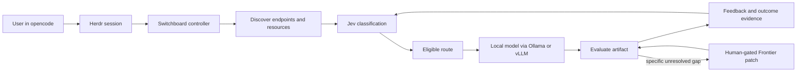
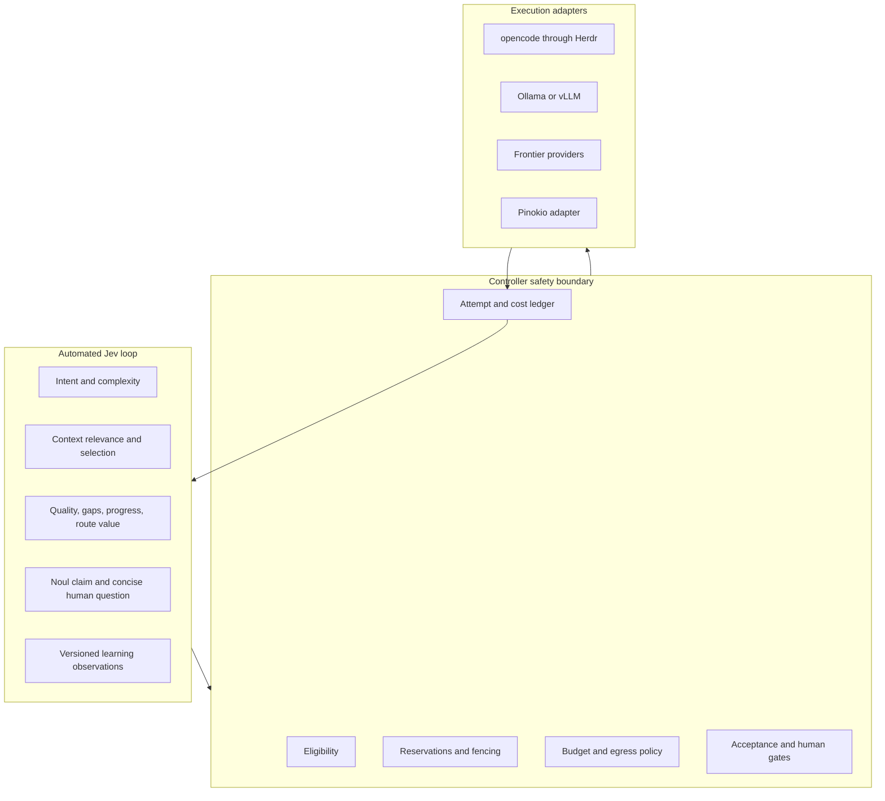
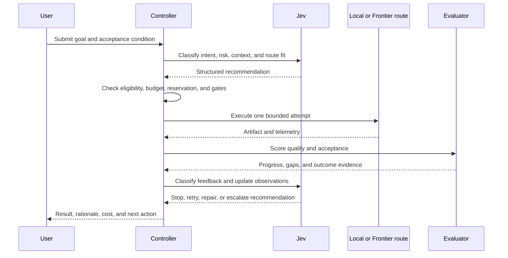

# Switchboard

## A local-first AI routing system that measures useful work

> **Pre-release project draft · 21 September 2026**

Switchboard is being designed to help people get more useful work from local AI before spending Frontier capacity.

It coordinates local models, agent harnesses, available hardware, context selection, evaluation, and human feedback. Jev classifies the work and learns which routes produce accepted outcomes. A controller enforces the boundaries that an AI decision must not override.

This repository is currently a design and qualification project. It is not yet a working router, hosted service, unattended automation system, or public model marketplace.

## The problem

An AI workflow can produce an invoice down to the penny without showing whether the spend bought useful work.

Token cost alone does not account for:

- retries and repeated attempts;
- context that was irrelevant or unnecessarily large;
- human review and approval time;
- exceptions, failed tools, and rework;
- local resources that were available but never used;
- Frontier calls that did not move the goal forward.

Switchboard is built around a more useful question:

> What did it cost to reach one accepted outcome, and why was the next action worth taking?

## The first user and first proof

The first user is the project owner running Switchboard against a personal local fleet. The first proof is intentionally small:

1. Submit a real goal through the normal opencode workflow.
2. Discover which local endpoints and models are actually available.
3. Let Jev classify intent, complexity, risk, context needs, and route fit.
4. Run an eligible local route through Herdr and opencode.
5. Evaluate the artifact against the goal.
6. Ask for concise human feedback only when the system needs it.
7. Select a bounded next action or stop.
8. Show the decision trace and compare the accepted-outcome cost with a Frontier-only path.

The first demonstration task is a small browser arcade game. It is concrete enough to evaluate while still exercising routing, context selection, code quality, review, and bounded improvement. ComfyUI and longer media workflows are later qualification trials, not current product claims.

## Current progress

### Complete

- Product vision and PRD documented.
- Cost-per-outcome definitions documented, including review, exceptions, retries, rework, and control friction as separate signals.
- Architecture spine finalized and linted.
- Ownership boundary defined: Jev classifies and learns; the controller enforces safety and resource policy.
- Default interaction model agreed: opencode through Herdr is the working UX; Switchboard is the informative control plane.
- Local endpoint discovery direction defined for Ollama and vLLM.
- Explicit installation gate defined for missing local runtimes.
- Human gates defined for installation, paid Frontier use, no-progress continuation, uncertainty, and high-risk actions.
- Public-safe vision and pre-release landing page drafted.

### In progress

- Epics and stories for onboarding, safe execution, and Jev feedback classification.
- Offline fixtures for route eligibility, resource reservations, attempt logging, budgets, feedback classification, bounded actions, and recovery.
- Public contribution and release evidence planning.

### Not started and intentionally gated

- Live local model execution.
- Frontier provider calls.
- Automatic endpoint installation.
- Fine-tuning or training jobs.
- Long media renders or full ComfyUI workflow automation.
- Hosted multi-tenant service operation.

No live capability is implied by this draft until the offline qualification fixtures pass.

## Architecture at a glance

### Ownership boundary

Jev may recommend a route, context set, feedback classification, or next action. It cannot silently bypass eligibility, spend policy, resource reservations, egress restrictions, acceptance gates, or the human review stop.

## Why Jev is central

Jev is not used as a general prose generator in the control path. It is used for narrow, structured decisions such as:

- What is the intent and domain of this request?
- How difficult, risky, or reversible is it?
- Which context is relevant enough to include?
- Is the local endpoint eligible for this task?
- Did the latest artifact satisfy the goal?
- What gap remains?
- Did the attempt make measurable progress?
- Is the next action worth its expected cost?
- Does the user need to answer a safety question before continuing?

This lets Switchboard automate routine classification and reduce wasted context while preserving a clear human boundary at consequential moments.

## The learning loop

The loop always has a stop condition. A plateau, budget cap, exception, stale block, or missing human answer stops progress rather than burning credits for zero productivity gain.

## The safety model

Switchboard separates different kinds of consequence:

| Situation | Default response |
| --- | --- |
| Local endpoint missing | Offer an explicit local installation action; never install silently |
| Local route unavailable | Mark it ineligible; do not treat infrastructure failure as quality exhaustion |
| Frontier spend required | Show the reason, expected progress, and budget impact; require approval |
| Two attempts plateau | Stop and ask a concise human question before continuing |
| Agent pane blocked | Track control friction separately from production cost |
| High-risk or hard-to-reverse action | Require a human gate regardless of model confidence |
| No acceptance evidence | Return the best candidate with the unresolved gap clearly stated |

## Roadmap

### Milestone 1 — offline-qualified routing

- Route eligibility fixtures.
- Atomic reservations and capacity checks.
- Attempt and cost ledger.
- Budgets and egress policy.
- Bounded next-action selection.
- Jev intent, context, feedback, and route-value classification fixtures.
- Human-gate and no-progress-stop fixtures.

### Milestone 2 — local execution

- Endpoint discovery for Ollama and vLLM.
- Default opencode route through Herdr.
- Model-store import and capability classification.
- Resource and context checks against the current machine.
- Safe local installation adapters where explicitly approved.

### Milestone 3 — measured escalation

- Frontier gap-fill path through Herdr.
- Cost-per-accepted-outcome reporting.
- Decision rationale and comparison with a Frontier-only baseline.
- Arcade game proof task.

### Later milestones

- ComfyUI and media workflow analysis.
- Fine-tuning and preference learning from accepted evidence.
- Rich observability dashboard.
- Public contributor workflows.
- Hosted multi-tenant operation, only after credential isolation and service governance are designed.

## What contribution means at this stage

The most useful early contributions are evidence and contracts, not speculative integrations:

- review the product and architecture assumptions;
- add deterministic qualification fixtures;
- improve route and outcome schemas;
- test endpoint and model capability discovery;
- document hardware and runtime compatibility;
- challenge safety gates and failure handling;
- propose reproducible evaluation tasks.

Please do not assume that example hardware, model names, prices, provider flags, or live integrations in the original blueprint are verified until they are backed by a fixture or current evidence.

## Project position

Switchboard is deliberately being built as a transparent, local-first control plane. The project will only claim efficiency when it can show the route taken, the resources used, the progress made, the human time involved, and the cost of reaching an accepted result.

**Status:** pre-release · architecture and qualification stage  
**Next evidence:** offline fixtures pass  
**Primary UX:** opencode through Herdr  
**Control plane:** Switchboard  
**Decision layer:** Jev  
**Default execution target:** eligible local model via Ollama or vLLM

