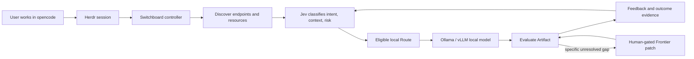
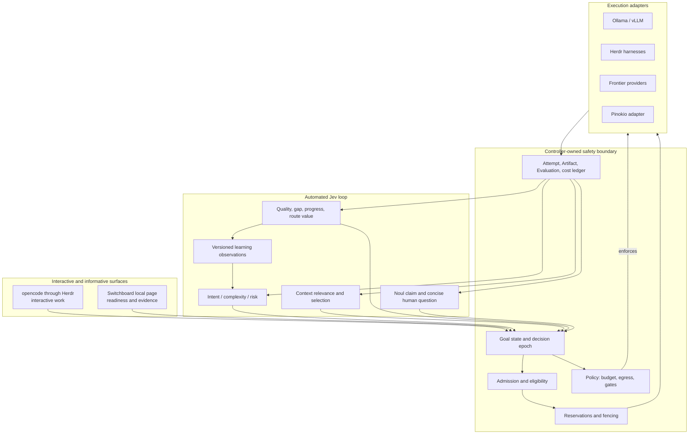
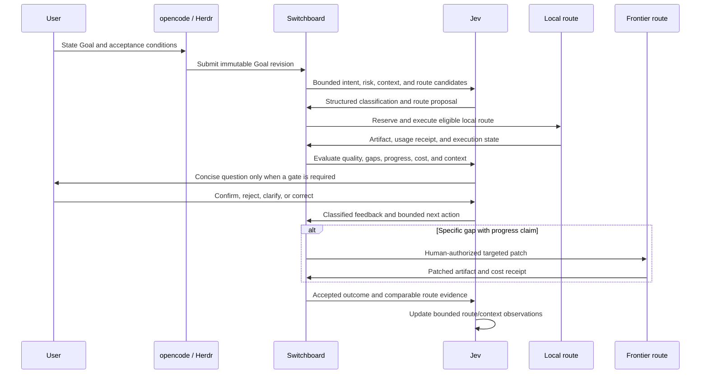

# Switchboard: vision and concept

> **Pre-release:** Switchboard is a local-first project under active design and fixture-led implementation. It is not yet a hosted service or an unattended paid automation system.

## Current progress

**Last updated: 21 September 2026 · story design → offline build**

- ✅ Vision, PRD, outcome definitions, human gates, and public-release boundaries documented.
- ✅ Architecture spine finalized and linted: controller ownership, Jev learning loop, Herdr/opencode, local runtime discovery, reservations, recovery, and cost accounting.
- 🔄 Epics and stories in progress: onboarding, safe execution, Jev feedback classification, and route-value learning.
- ➡️ Next: deterministic offline fixtures for eligibility, reservations, recovery, Noul/feedback classification, bounded actions, and context selection.
- ⏸️ Live model runs, Frontier calls, installation, training, and full media renders remain gated and have not started.

Switchboard helps an AI-agent operator use local intelligence first, select routes with evidence, and spend Frontier capacity only when a specific unresolved gap justifies it.

The product is not another chat interface and not another model. The primary interactive experience is opencode through Herdr. Switchboard is the informative control plane around that experience: it discovers resources, filters eligible routes, coordinates execution, evaluates outcomes, records cost, and feeds structured feedback back into Jev.

## The idea in one sentence

Give Jev the job of classifying the work, selecting useful context, learning which routes produce accepted outcomes, and proposing the next move—while the controller enforces the boundaries that probabilistic decisions cannot override.

## The default path

The first default route is Herdr → opencode → an eligible local model served by Ollama or vLLM. If an endpoint is missing, Switchboard may offer a local installation action, but installation is a separate explicit confirmation because it changes the machine. Missing local infrastructure is not treated as local quality exhaustion and must not silently become Frontier spend.

## The architecture boundary

Jev performs the routine classification and learning. The controller remains authoritative for:

- route eligibility and resource reservations;
- acceptance criteria and artifact integrity;
- budget, egress, installation, and Frontier gates;
- recovery, reconciliation, and rollback;
- durable lineage and cost-per-accepted-outcome accounting.

Pinokio is an adapter Switchboard may call when its API and authorization are verified. Switchboard does not duplicate Pinokio’s workflow sequencing without an explicit ownership decision.

## The learning loop

The user provides feedback; the user does not manually calculate which model, harness, machine, or retry count should be used. Jev classifies the signal and Switchboard applies the hard boundaries.

## Why context selection matters

Large context piles create wasted input tokens and less specific Frontier output. Switchboard lets retrieval produce a bounded candidate set, then uses Jev to score relevance, rerank difficult candidates, and select a smaller context envelope.

Every selection records:

- candidate provenance and source IDs;
- relevance scores and ranks;
- selected and excluded context;
- tokens before and after selection;
- estimated Frontier input cost avoided;
- acceptance quality and evidence coverage;
- fallback behavior when Jev is unavailable or uncertain.

The goal is not the smallest prompt. The goal is the smallest sufficient prompt.

## First proof: a retro arcade game

The first representative Goal is a small browser Pong-style game. It is deliberately concrete enough to evaluate while still exercising several cooperating capabilities:

1. discover a usable local route;
2. run through opencode and Herdr;
3. evaluate a real Artifact;
4. classify the gap and feedback with Jev;
5. use a targeted Frontier patch only if it has a measurable progress claim;
6. compare the result with a declared single-Frontier baseline by accepted quality and total workflow cost.

The next family is ComfyUI/Blender workflow analysis, followed by staged H3 qualification. A full 21-minute render is never the first experiment: seam tests, short chains, and an 80-plus-segment preview must pass before production authorization.

## What “value” means

`cost per accepted outcome = total eligible workflow cost / accepted Goals`

The numerator includes retries, tool calls, evaluator work, exceptions, human review, rework, and known local operating costs. Unknown dimensions remain unknown or estimated; they are not silently zero. Blocked waiting is reported separately unless an explicit policy says otherwise.

The denominator is workload-specific. Resolution rate, acceptance policy, evaluator version, sample count, exclusions, and uncertainty must be visible beside the result.

## Pre-release boundaries

- Local-first, single-user operation comes before hosted multi-tenancy.
- opencode through Herdr is the interactive UX; Switchboard is informative and safety-critical.
- No silent Frontier fallback when local infrastructure is missing or unreachable.
- No installation or machine mutation without explicit confirmation.
- No spend-bearing continuation without a progress claim and required human gate.
- No automatic continuation after no progress, regression, or uncertain cost.
- No raw hidden chain-of-thought or unrestricted pane transcripts required for explainability.
- No automatic training, fine-tuning, model downloads, or publication in the initial milestone.

## Contributing direction

The first useful contribution is a deterministic fixture, not a provider credential. Good early work includes:

- fake resource snapshots and reservations;
- Ollama/vLLM endpoint adapters;
- Herdr/opencode result fixtures;
- Jev response validation and deterministic fallbacks;
- context-selection comparisons;
- Noul and feedback-learning fixtures;
- Pong acceptance checks;
- ComfyUI/H3 qualification evaluators.

See the [build brief](build-brief.md), [integration plan](integration-plan.md), [current architecture reference](switchboard_3.html), and [landing page](index.html).
